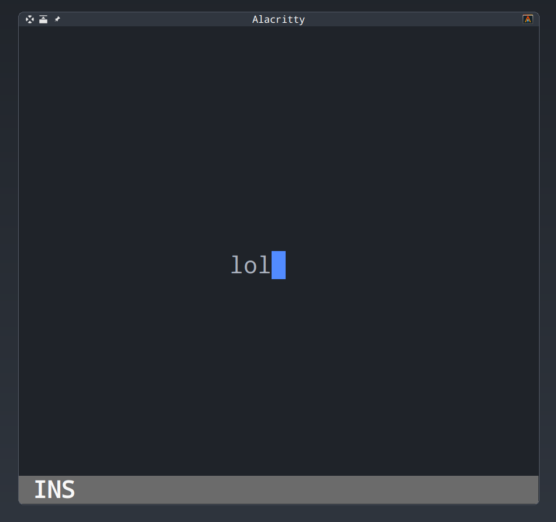

# Edt

Simple text editor in the terminal using the [crossterm](https://github.com/crossterm-rs/crossterm) library from Rust

<p align=center>
    
</p>

## Development

Building:

```console
cargo build
```

Running:

```console
cargo run
```
